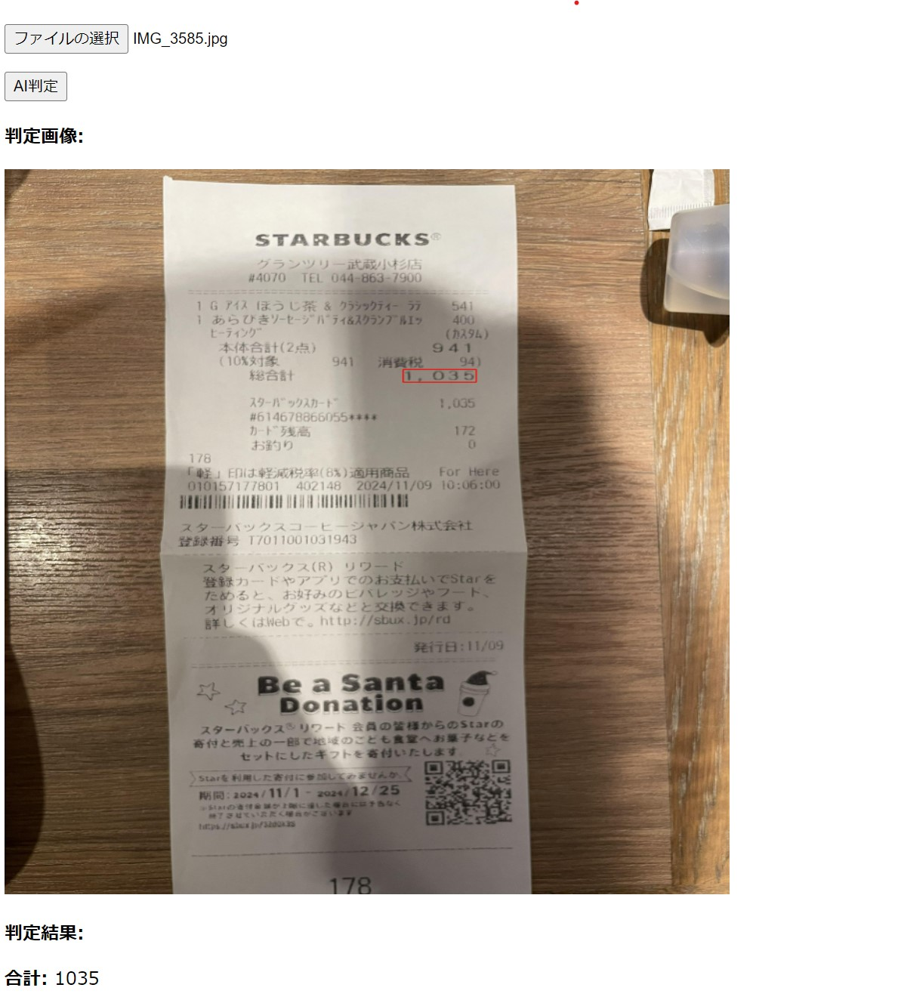

## API の概要

レシートの合計金額 OCR



## 使用している AI モデル

VisionAPI

## 環境

python3.10.15
Ubuntu20.04.06 LTS

## 起動方法

1.Window 上に WSL 経由で Ubuntu アプリをインストール
以下 Ubuntu アプリ内で実行

2.Python のインストール

```
sudo apt update

sudo apt install software-properties-common

sudo add-apt-repository ppa:deadsnakes/ppa

sudo apt update

sudo apt install python3.10

python3.10 --version
```

3.仮想環境の作成

```
python3.10 -m venv [your_env_name]

cd [your_env_name]

source bin/activate
```

4.git のクローンとライブラリインストール

```
mkdir work

cd work

git clone https://github.com/takuya-fukuda/ocr_api.git

cd backend

pip install -r requirements.txt

python run.py
```

## POST リクエスト

| body               | 型  |
| ------------------ | --- |
| 画像データ(base64) | ?   |

## レスポンス

| キー  | 型  | サンプル                      |
| ----- | --- | ----------------------------- |
| sum   | str | 800                           |
| image | str | fa;jgiegjaj;alse**\*\***acdfe |

## アプリケーションルート

| パス                        | 概要             |
| --------------------------- | ---------------- |
| http://publicIP:5000/       | ヘルスチェック用 |
| http://publicIP:5000/image/ | 券面 OCR 用      |

## Flask フォルダ構成(VisionAPI)

| filename             | description                                                                     |
| -------------------- | ------------------------------------------------------------------------------- |
| run.py               | API 起動用ファイル                                                              |
| api/config/\*        | DB などの設定ファイルが格納される                                               |
| api/model/\*         | PaddleOCR のモデルファイルが格納される                                          |
| api/**init**.py      | アプリケーションルート設定ファイル                                              |
| api/ocr.py           | /image/の全体処理が記載されたファイル。前処理 ⇒ 推論 ⇒ 後処理の原則に基づき記載 |
| api/preparation.py   | 前処理ファイル。ocr.py から参照される                                           |
| api/visionapi_ocr.py | 推論用コード。ocr.py から参照される                                             |
| api/postprocess.py   | 後処理ファイル。ocr.py から参照される                                           |
